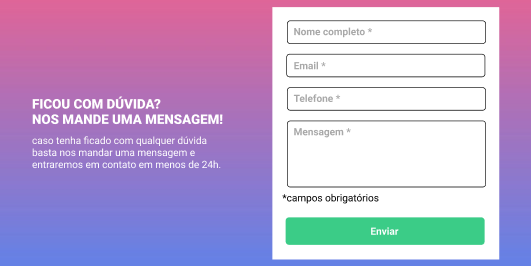
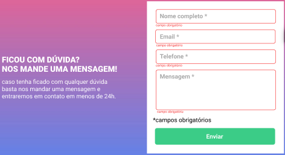
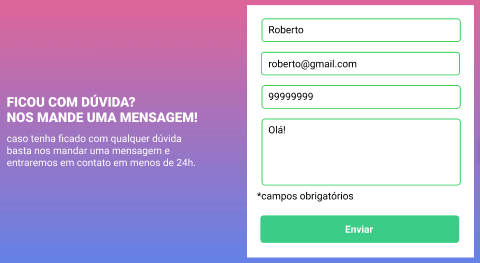
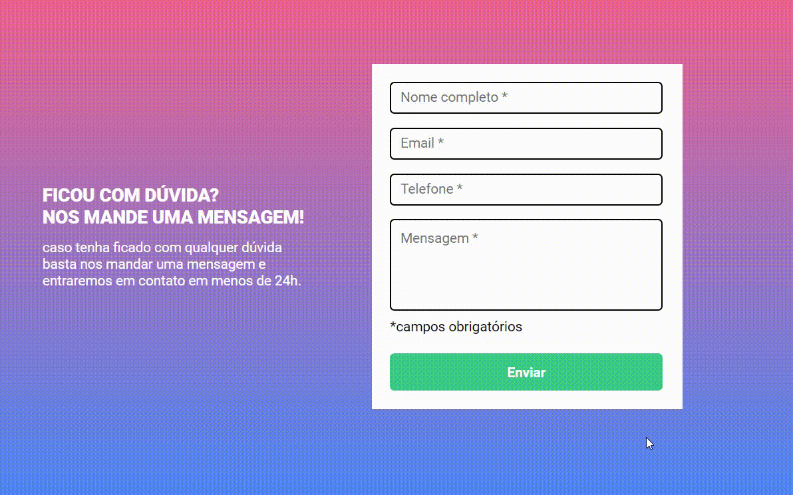

# CURSO DEV QUEST - APRENDA PROGRAMAÇÃO DO ZERO
## 2ª QUEST - HTML + CSS + JS INTERMEDIÁRIO

### O que é uma QUEST?
Quests são desafios a serem feitos ao longo do curso para testar os conhecimentos , a segunda quest é referente ao final dos módulos referentes ao JavaScript Básico e Intermediário.

### Sobre essa QUEST
O desafio é criar um formulário com validação, para mais detalhes segue o link do documento com as instruções no [Google Drive](https://drive.google.com/file/d/1jM7DspVoIVbxE4OAeAAslwJn6lUoGMvL/view).

### Layout
Segue abaixo as imagens do desafio, para maiores detalhes segue o link do layout no [Figma](https://www.figma.com/file/zBKnYG9UNdUiIr8ClQTWSG/DESAFIO---HTML%2FCSS%2FJS-INTERMEDI%C3%81RIO?node-id=1376%3A82&mode=dev). A primeira imagem é do formulário sem validação, a segunda e a terceira imagem é o formulário com as possíveis validações 👇
#### Formulário sem validação

#### Formulário com validação dos campos não preenchidos

#### Formulário com validação dos campos preenchidos

### Projeto
Segue abaixo alguns gifs do projeto rodando, mostrando o formulário com as validações propostas 👇

#### Mostrando a menssagem de erro

#### Mostrando o formulário preenchido

#### Mostrando a mensagem de erro em alguns campos não preenchidos

### Tecnologias utilizadas
* [HTML](https://developer.mozilla.org/pt-BR/docs/Web/HTML)
* [CSS](https://developer.mozilla.org/pt-BR/docs/Web/CSS)
* [JavaScript](https://developer.mozilla.org/pt-BR/docs/Web/JavaScript)

### Autor
Eduardo Sousa

Entre em contato 👇
 

